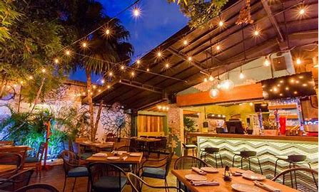
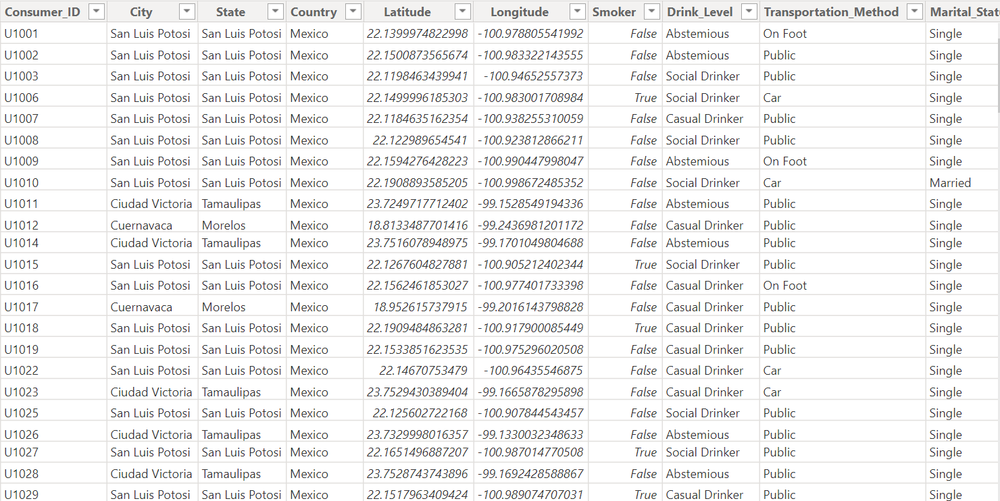
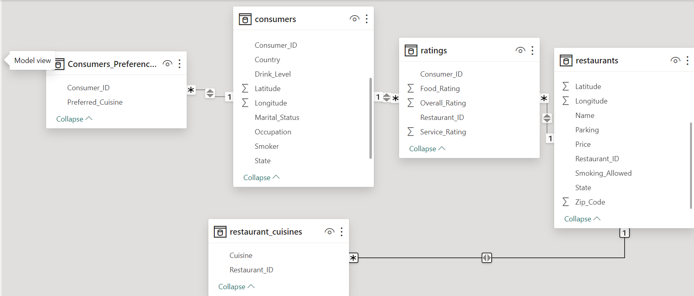
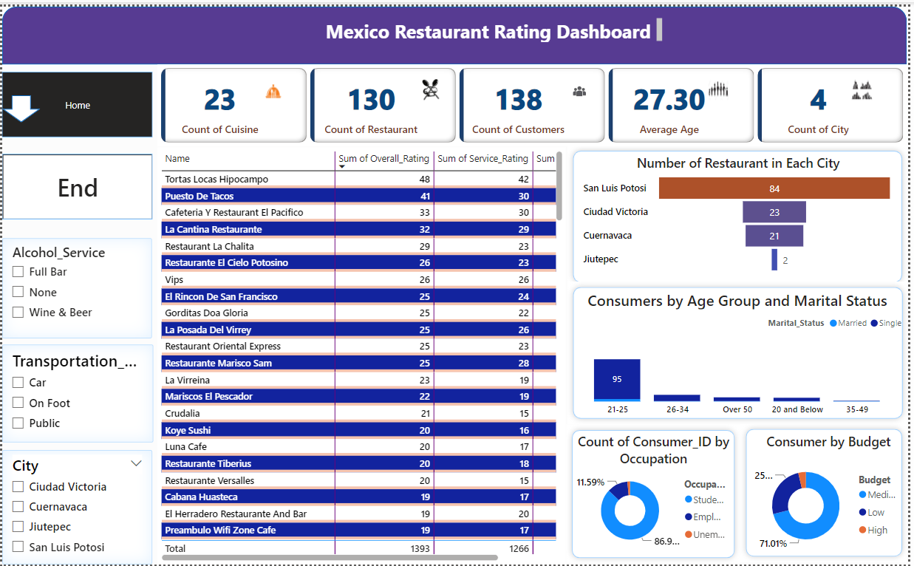
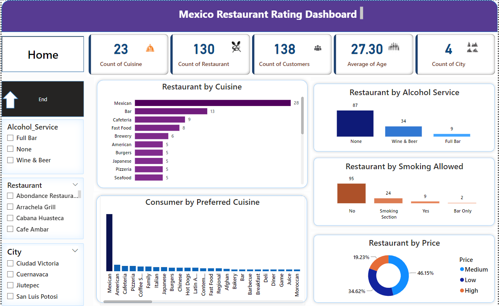
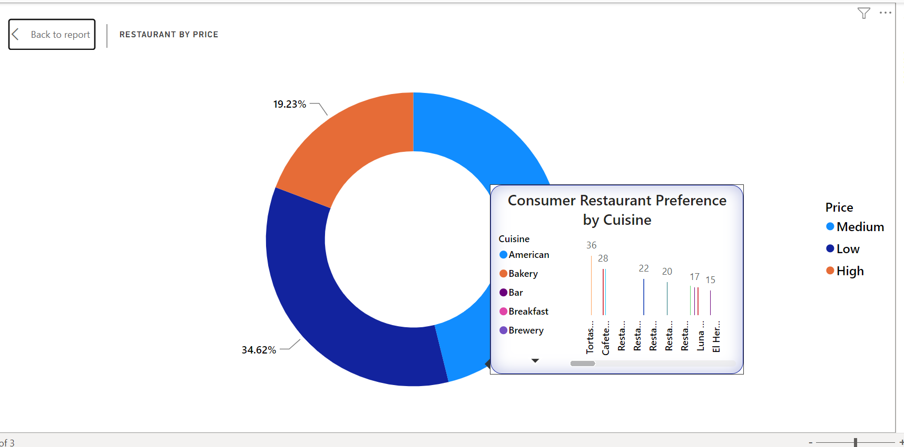
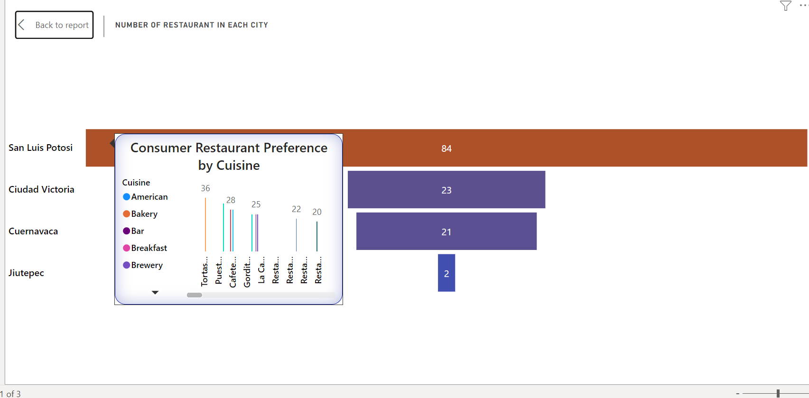

# Mexico Restaurant Rating Dashboard

---
## INTRODUCTION:
Mexican food is popular because it’s full of flavor. The Mexican dishes include healthy and fresh ingredients like avocados, beans, corn, tomatoes and other vegetables, and different types of meat like beef, chicken, pork, and fish even rabbit, lamb, among others used in , tamales, tacos or soups.
The food industry is teeming with successful Mexican restaurants, also known as **_‘Restaurante_**in Spanish.
The focus of this project is to analyze restaurant ratings in Mexico by real consumers from 2012. 

## PROBLEM STATEMENT:
- What can you learn from the highest rated restaurants? Do consumer preferences have an effect on ratings?
-	What are the consumer demographics? Does this indicate a bias in the data sample?
-	Are there any demand & supply gaps that you can exploit in the market
-	If you were to invest in a restaurant, which characteristics would you be looking for?

## POWER BI CONCEPT APPLIED: 
- Data Modeling: Snowflakes schema
- Page Navigation
- Filters
- Tooltips

## DATA SOURCING 
This dataset was provided by Digitaley Drive as my project as a scholarship student

It contains 5 sheet/tables 
- CONSUMERS with 138 rows and 15 columns 
- CONSUMERS_PREFERENCE with 330 rows and 2 columns
- RATINGS with 1161 rows and 5 columns
- RESTAURANT_CUISINES with 112 rows and 2 columns
- RESTAURANT with 130 rows and 14 columns

## DATA TRANSFORMATION/CLEANING
Data was effectively cleaned and transformed with the power query editor of power BI.
Some of the applied steps include: 
- CLEANING THE DATA: The process involved eliminating excess spaces, addressing and handling all blank cells, removing duplicates, performing a spellcheck, and converting numbers stored as text into numerical values. Additionally, I ensured that the data was accurately categorized.
- I created a conditional Column to group age.
  
## DATA MODELING:
 Following the data transformation, I engaged in data modeling by examining relationships. Post-cleaning the data using Power Query, I imported it into Power BI, where relationships were automatically established. Nevertheless, I meticulously verified for errors and confirmed the presence of accurate relationships among each data type. The significance of establishing correct connections lies in enabling meaningful analysis and visualization; without them, data analysis becomes unfeasible, rendering it ineffective

 
---

## DATA ANALYSIS AND VISUALS:

---

In crafting this visualization, I incorporated several slicers. Through thorough analysis, I unveiled key insights: there are four cities represented, featuring 130 restaurants and serving 138 consumers. The culinary diversity spans 23 cuisines.

## CONCLUSION AND RECOMMENDATION
- Tortas Locas Hipocampo is the restaurant with the highest rating. It had the highest food and service rating. Some of the factors responsible for Tortas Locas Hipocampos’ rise to the top of the restaurant ratings in Mexico include:
  
a. This visual shows that Tortas Locas Hipocampo is one of the restaurant that offers medium price cuisine. This makes it possible for consumers to patronize this restaurant. Also, most consumers have a medium budget.

b.This Visual shows that Tortas Locas Hipocampos is located in San Luis Potosi. San Luis Potosi is the city that has most restaurants.
- Consumer preferences do not necessarily influence the ratings, as an interesting contrast emerges. While Mexican cuisine stands out as the most preferred among consumers, the highest-rated restaurant does not specialize in Mexican cuisine. This underscores the significant nature of the relationship between consumer preference and restaurant ratings.
- 21–25 age group had the most consumers. Total of 101 consumers are in this age group, 95 are single while 6 are married.
- A significant 86.96% of restaurant patrons fall into the student category, with 11.59% being employed and a minor 1.45% being unemployed. Surprisingly, students overwhelmingly dominate restaurant patronage in the three cities covered by this dataset in Mexico. This trend might be attributed to the proximity of restaurants to educational institutions. Conversely, the employed segment may face challenges in visiting restaurants due to their demanding schedules. It's crucial to note that when considering age groups, the 21–25 age group emerges as the one with the highest number of consumers.
- Tortas Locas Hipocampos does not offer alcohol service and maintaining a no-smoking policy. Despite these restrictions, it remarkably stands out as the highest-rated restaurant. Evidently, the absence of alcohol service and smoking facilities does not adversely impact the restaurant's popularity among patrons.
- Consumer preferences clearly favor Mexican cuisine, with American cuisine trailing at a considerable distance as the second choice. For a lucrative restaurant investment in Mexico, I strongly recommend focusing on Mexican cuisines to align with the predominant taste preferences and ensure success.

- 

